###JVM
    Java通过将Java的源码文件编译成字节码文件，在JVM上通过类加载器对文件进行加载创建对象实例来完成编译运行。JVM同时负责内存的分配调用，可以内存使用问题可以通过JVM相关分析来Debug。字节码文件运行时会通过JVM创建栈桢来实现内存分配，JVM内存模型部分详细描述了JVM的内存结构包括栈桢内部结构。类加载器分三类，包括启动类、扩展类和应用类加载器，机制有双亲委派以及负责依赖等。JVM调优包括根据使用设置不同的JVM参数与GC策略，诸如G1GC和ZGC等。

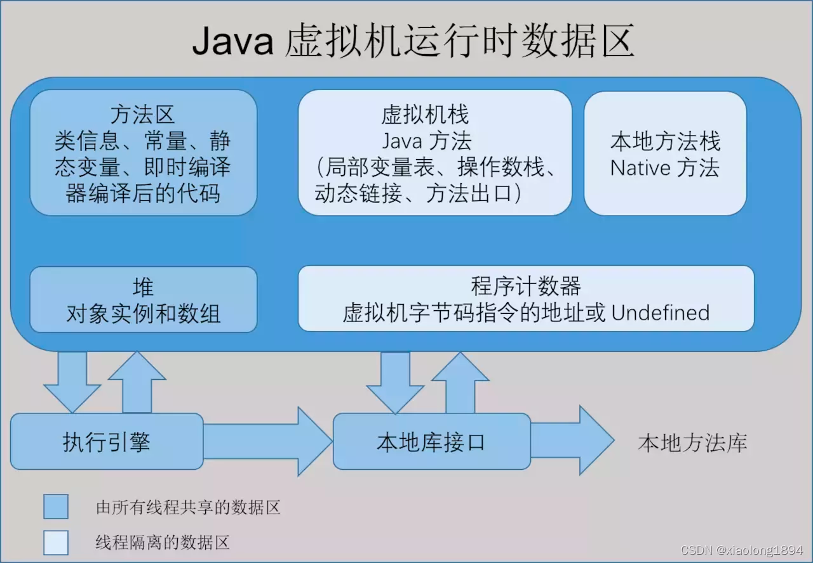

###NIO
    Netty 是一个高性能、异步事件驱动的 NIO 框架，基于 JAVA NIO 提供的 API 实现。它提供了对 TCP、UDP 和文件传输的支持，作为一个异步 NIO 框架，Netty 的所有 IO 操作都是异步非阻塞的，通过 Future-Listener 机制，用户可以方便地主动获取或者通过通知机制获得 IO 操作结果。在此我向大家推荐一个架构学习交流圈。交流学习指导伪鑫：1253431195（里面有大量的面试题及答案）里面会分享一些资深架构师录制的视频录像：有Spring，MyBatis，Netty源码分析，高并发、高性能、分布式、微服务架构的原理，JVM性能优化、分布式架构等这些成为架构师必备的知识体系。

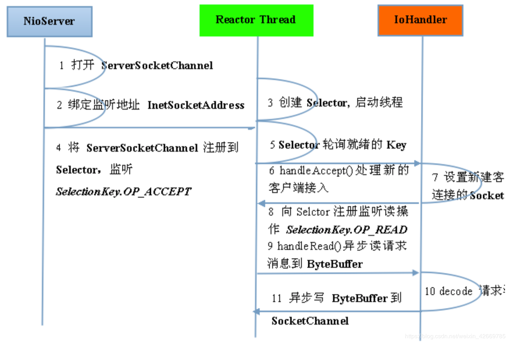

###并发编程
    1、线程并非使用的越多越好，在资源限定的情况下，使用过多的线程可能会更慢，因为上下文切换会耗费资源。当一个线程拿到CPU时间片，然后运行一段时间以后，另一个线程获得了CPU时间片，该线程的运行状态就会保存下来，以便再次获得CPU时间片的时候可以再加载这个状态，这个线程从保存到再加载的过程就是一次上下文切换的过程。
    
    2、为了减少上下文切换带来的资源浪费，可以用以下三个方法： 使用无锁并发编程、使用CAS算法、使用最少线程、使用协程。无锁并发编程：一堆任务，可以根据取模算法，将数据根据id分为不同的线程，不用的线程执行自己负责的数据范围。
    
    3、volatile能保证可见性，无法保证原子性。何为可见性：当一个线程修改了共享变量，另一个线程能读到这个修改的值。
    
    volatile怎么保证数据的可见性的？多个处理器共享一个变量，会将变量在内存中的地址存储到处理器自己的高速缓存区（L1L2L3），当给变量加上volatile时，一个处理器对变量进行修改时，会将修改的数据直接回写到内存中，为了保证多处理器的缓存一致，就会实现缓存一致性，每个处理器会通过嗅探总线上的数据来感知自己的数据是否过期了，当处理器发现自己缓存行对应的内存地址被修改了，就会将缓存行设置为失效。当对这个数据进行再操作时，会重新从内存中把数据读到处理器的缓存中。
    
    4、处理器如何保证操作的原子性的？两个方法：总线锁、缓存锁。但是总线锁会将CPU与内存之间的通信锁住，锁定期间，其他处理器不能操作其他内存地址的数据，因此开销比较大，一般都使用缓存锁，不同的处理器使用的不一样，根据情况而定。

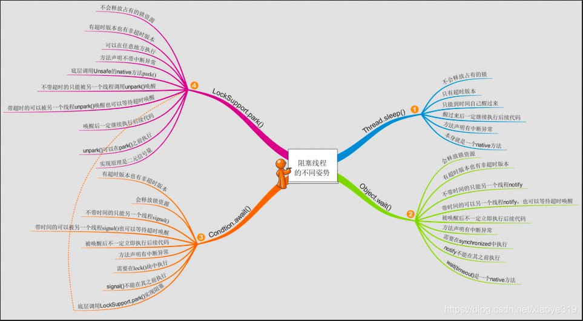

### Spring 和 ORM 等框架
    Spring是分层的Java SE/EE 应用 full-stack 轻量级开源框架，以IoC(Inverse Of Controller:控制反转) 和AOP(Aspect Oriented Programming：面向切面编程)为内核，
    提供了展现层Spring MVC和持久层Spring JDBC以及业务层事务管理等众多的企业级应用技术，还能整合开源世界众多著名的第三方框架和类库，逐渐成为使用最多的Java EE企业应用开源框架。
    1、方便解耦，简化开发
    
    通过Spring提供的IoC容器，可以将对象间的依赖关系交由Spring进行控制，避免硬编码所造成的过度程序耦合。用户也不必再为单列模式类、属性文件解析等这些很底层
    
    的需求编写代码，可以更专注于上层的应用。
    
    2、AOP编程的支持
    
    通过Spring的AOP功能，方便进行面向切面的编程，许多不容易用OOP实现的功能可以通过AOP轻松应付
    
    3、声明式事务的支持
    
    可以从单调烦闷的事务管理代码中解脱出来，通过声明式方式灵活的进行事务的管理，提高开发效率和质量。
    
    4、方便程序的测试
    
    可以用非容器依赖的编程方式进行几乎所有的测试工作，测试不再是昂贵的操作，而是随手可做的事情。
    
    5、方便集成各种优秀框架
    Spring可以将降低各种框架的使用难度，提供了对各种优秀框架(Struts、 Hibernate、 Hessian、 Quart等)的直接支持。
    
    6、降低JavaEE API的使用难度
    
    Spring对JavaEE API（如 JDBC、JavaMail、远程调用等）进行了薄薄的封转层，使这些API的使用难度大为降低。
    
    7、Java源码是经典学习范例
    
    Spring的源代码设计精妙、结构清晰、匠心独用，处处体现着大师对Java设计模式灵活运用以及对Java技术的高深造诣。它的源代码
    是Java技术的最佳实践的范例。
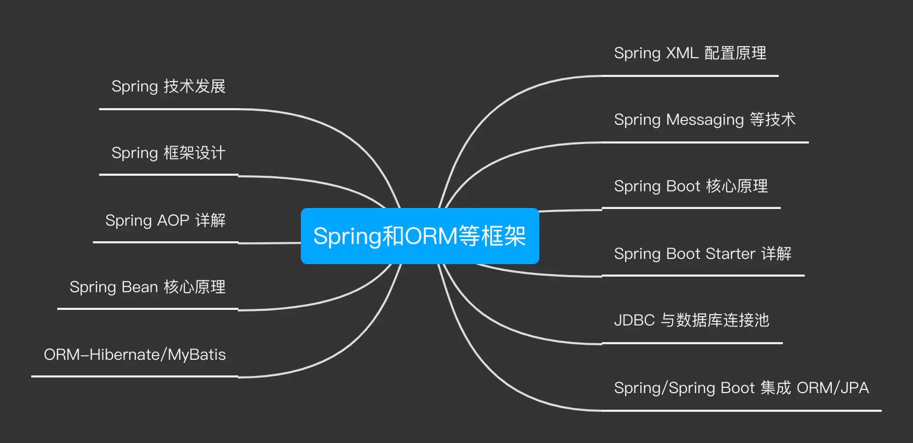

### MySQL 数据库和 SQL
    MySQL数据库. MySQL 是一种 开放源代码 的关系型 数据库管理 系统（RDBMS），使用最常用的数据库管理语言-- 结构化查询语言（SQL）进行数据库管理。MySQL是开放源代码的，因此任何人都可以在General Public License的许可下下载并根据个性化的需要对其进行修改。MySQL因为其速度、可靠性和适应性而备受关注。大多数人都认为在不需要事务化处理的情况下，MySQL是管理内容最好的选择。
    1. 1NF字段不可拆分 （可拆分的例子：中国广东广州xx街道）
    2. 2NF列都完全依赖于主键，否则要拆分（如果出现不完全依赖，只可能发生在联合主键的情况下，此时也要拆分为多个表）
    3. 3NF依赖不能有传递关系，否则要拆分

1.设置事务（默认 autocommit=1 开启自动提交）

> set autocommit = 0 or 1; (0的时候是关闭自动提交，开启手动提交)

2. 查看事务

> select @@AUTOCOMMIT;

3. 回滚到最后一次提交（撤销）

> rollback;

4. 事务开启后，需要手动提交数据（提交后则无法回滚）

> commit;

5. 事务的开启

> ① begin；
>
> ② start transaction；
    
####事务
    1. 原子性 
    事务是最小单位，不可再分割，要么一起成功，要么一起失败。

    1. 一致性
    编写的程序某个特性要一致，如：not null。

    2. 隔离性（**表中下面的隔离级别高，性能低**）
    并发事务之间是隔离的，在事务未提交之前不能被其他session查看

    3. 持久性
    事务一旦提交则对数据的改变是无法回滚的。

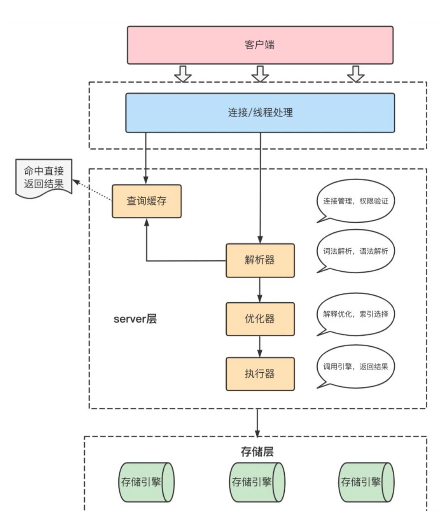

### 分库分表
    分库分表方案是对关系型数据库数据存储和访问机制的一种补充。
    分库：将一个库的数据拆分到多个相同的库中，访问的时候访问一个库
    分表：把一个表的数据放到多个表中，操作对应的某个表就行
    垂直拆分特点
    1.每个库（表）的结构都不一样
    2.每个库（表）的数据至少一列一样
    3.每个库（表）的并集是全量数据
    
    垂直拆分优缺点
    
    优点：
    1.拆分后业务清晰（专库专用按业务拆分）
    2.数据维护简单，按业务不同，业务放到不同机器上
    
    缺点:
    1.如果单表的数据量，写读压力大
    2.受某种业务决定，或者被限制，也就是说一个业务往往会影响到数据库的瓶颈（性能问题，如双十一抢购）
    3.部分业务无法关联join，只能通过java程序接口去调用，提高了开发复杂度
    水平拆分特点
    1.每个库（表）的结构都一样
    2.每个库（表）的数据都不一样
    3.每个库（表）的并集是全量数据
    
    水平拆分优缺点
    
    优点：
    1.单库/单表的数据保持在一定量（减少），有助于性能提高
    2.提高了系统的稳定性和负载能力
    3.拆分表的结构相同，程序改造较少。
    
    缺点:
    1.数据的扩容很有难度维护量大
    2.拆分规则很难抽象出来
    3.分片事务的一致性问题部分业务无法关联join，只能通过java程序接口去调用
\

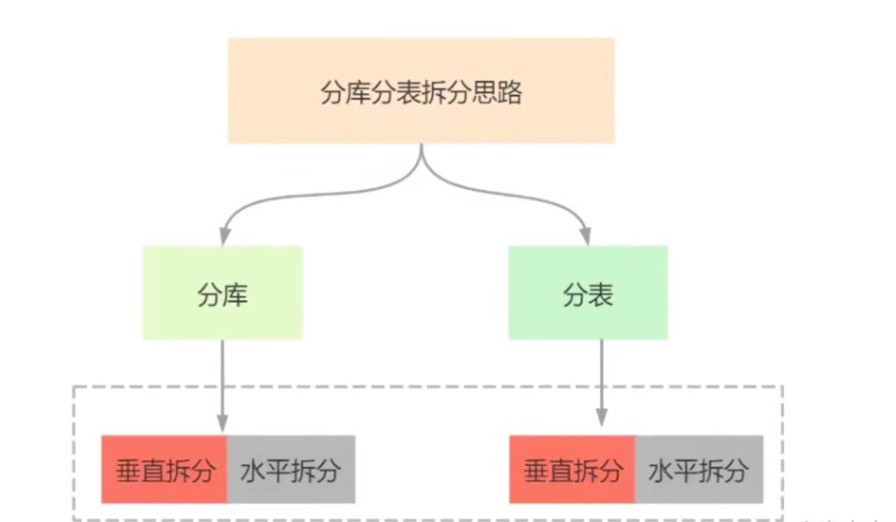

### RPC 和微服务
    微服务是一种分布式的方式，通过微服务可以将业务拆分，使业务职责单一化，业务解耦。微服务通常都是集群部署，服务之间的通信需要通过RPC完成。集群需要通过服务治理去管理，服务治理主要管理：接口方法和服务之间的映射关系、负载均衡、健康检测、服务续约、服务发现、容灾容错等。
    一、RPC
    其中RPC主要是通过TCP传输协议和高效的序列化反序列完成。高性能的TCP传输手动主要是通过IO的多路复用和零拷贝，最典型的NIO框架就是netty，而IO的多路复用主要手段有select、poll、epoll，其中epoll是liunx主要的io多路复用模型的手段，也是性能最高的。并且RPC一般还支持插件拓展的spi机制。
    
    动态代理
    RPC 会自动给接口生成一个代理类，当我们在项目中注入接口的时候，运行过程中实际绑定的是这个接口生成的代理类。这样在接口方法被调用的时候，它实际上是被生成代理类拦截到了，这样我们就可以在生成的代理类里面，加入远程调用逻辑。常用的动态代理技术有:JDK动态代理、Javassist、Byte Buddy、cglib等

    io多路复用：
    dubbo使用的TCP框架是netty 是io多路复用模型,相比springcloud的http性能上更胜一筹。io多路复用模型主要有以下几种：
    select：用户态每次都将连接的文件描述符放在一数组中，每次调用select时，都需要将整个数组拷贝到内核中，让内核去轮询文件描述符，之后内核会将数组中有数据的文件描述符标记，然后返回可读文件描述符的个数，具体哪个可读还是要用户自己遍历找出被标记的文件描述符。
    二、服务治理
    服务治理主要有：服务发现、服务续约、健康检测、负载均衡、容灾容错等。主要是通过将服务注册到注册中心实现这些功能。比较出名的注册中心有：Eureka、nacos、zookeeper等
    服务发现
    服务发现主要是维护调用接口和服务提供方地址的映射，可以帮助我们定位调用服务提供方的IP地址和维护集群的IP地址动态变化。有了服务发现我们就可以从集群中获取相应接口的IP集合通过负载均衡的方式选择其中的ip地址进行调用，这也PRC的服务发现机制。服务发现通过以下两种方式实现：
    1、服务注册：在服务提供方启动的时候，将自己的节点消息(IP地址、端口、服务接口等)注册到注册中心。
    2、服务订阅：在服务调用方启动的时候，去注册中心查找并订阅服务提供方的 IP，然后缓
    存到本地，并用于后续的远程调用。
    3、服务续约：定时的从注册中心拉取其他节点的信息，更新本地缓存。
    
    目前比较流行的服务发现的框架有zookeeper、Eureka、nacos。一个分布式系统不可能同时满足C(一致性)、A(可用性)和P(分区容错性)，其中zookeeper是cp，Eureka是AP。
    其中eureka的自我保护模式能在短时间内丢失过多的客户端时（可能发送了网络故障），那么这个节点将进入自我保护模式，不再注销任何微服务，当网络故障回复后，该节点会自动退出自我保护模式。在大规模集群服务发现系统的时候，舍弃强一致性，更多地考虑系统的健壮性，最终一致性才是分布式系统设计中更为常用的策略
    
    健康检测
    在PRC进行负载均衡调用服务的时候通常需要是需要知道哪些IP地址的节点可以哪些节点不可用，这些信息需要注册中心对注册的服务节点进行健康检测，最常用的方法就是定时的心跳检测，通过建立的TCP连接上发送类似ping的请求。根据服务节点的回复情况可以分为以下三种状态：
    1、康状态：建立连接成功，并且心跳探活也一直成功。
    2、亚健康状态：建立连接成功，但是心跳请求连续失败。
    3、死亡状态：建立连接失败。
    
    心跳检测的频率不同的框架都不一样，像Eureka就是30秒一次心跳，90秒内未收到续约，就会将服务剔除
    
    负载均衡
    微服务框架或者RPC框架都是会带有负载均衡的功能，也是集群必备的能力。一般都是从注册中心上拉取服务提供方的信息缓存在本地后，当调用相应的接口服务时，会从对应接口的服务提供方节点的集合中选择一个可以的节点进行调用，具体调用哪个节点会有不一样的选择策略，例如：轮询、随机、权重轮询、最少活跃调用数、一致性hash等。
    
    例如：springcloud的Ribbon，就是springcloud服务消费和负载均衡的核心组件。Ribbon是基于http和tcp的负载均衡组件，eureka利用ribbon实现了服务消费，Ribbon通过配置的服务列表进行轮询访问，但与eureka集成使用时，服务列表会被eureka的服务列表所重写，拓展成从注册中心获取服务列表（eureka的服务列表就是从注册中心拉取的服务节点的信息数据）。同时将自身的Iping功能替换成eureka的NIWSDiscoveryPing功能，由eureka去确认哪些服务可用，因此Ribbon利用了eureka注册中心服务发现、服务注册、服务续约和健康检测的机制，完成发现可用服务的节点地址及健康信息，然后利用自身的负载策略进行服务的消费。
    
    熔断限流降级
    熔断限流降级是微服务分布式系统必备功能，它主要应对，访问流量过大、节点负载过高和业务时间过长所引起的诸多问题。通过熔断、降级可以保护系统因业务处理时间过长导致过多接口服务超时的级联故障问题，限流保护系统避免流量访问过大，节点负载过高的问题。
    对应熔断限流降级业界最经典的莫过于Springcloud的Hystrix，Hystrix实现了一整套熔断限流降级的思想。
    
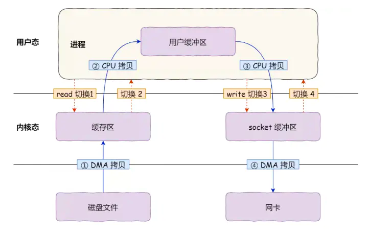

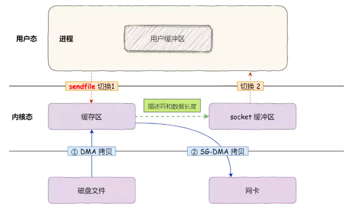
    

### 分布式缓存
    使用缓存我们得到以下收益：
    
    加速读写。因为缓存通常是全内存的，比如Redis、Memcache。对内存的直接读写会比传统的存储层如MySQL，性能好很多。举个例子：同等配置单机Redis QPS可轻松上万，MySQL则只有几千。加速读写之后，响应时间加快，相比之下系统的用户体验能得到更好的提升。
    
    降低后端的负载。缓存一些复杂计算或者耗时得出的结果可以降低后端系统对CPU、IO、线程这些资源的需求，让系统运行在一个相对资源健康的环境。
    
    但随之以来也有一些成本：
    
    数据不一致性：缓存层与存储层的数据存在着一定时间窗口一致，时间窗口与缓存的过期时间更新策略有关。
    
    代码维护成本：加入缓存后，需要同时处理缓存层和存储层的逻辑，增加了开发者维护代码的成本。
    
    运维成本：引入缓存层，比如Redis。为保证高可用，需要做主从，高并发需要做集群。
    
    综合起来，只要收益大于成本，我们就可以采用缓存。
    缓存的数据一般都是有生命时间的，过了一段时间之后就会失效，再次访问时需要重新加载。缓存的失效是为了保证与数据源真实的数据保证一致性和缓存空间的有效利用性。下面将从使用场景、数据一致性、开发运维维护成本三个方面来介绍几种缓存的更新策略。

    1、LRU/LFU/FIFO
    
    这三种算法都是属于当缓存不够用时采用的更新算法。只是选出的淘汰元素的规则不一样：LRU淘汰最久没有被访问过的，LFU淘汰访问次数最少的，FIFO先进先出。
    
    一致性：要清理哪些数据是由具体的算法定的，开发人员只能选择其中的一种，一致性差。
    
    开发维护成本：算法不需要开发人员维护，只需要配置最大可使用内存即可，然后选择淘汰算法即可，故成本低。
    
    使用场景：适合内存空间有限，数据长期不变动，基本不存在数据一不致性业务。比如一些一经确定就不允许变更的信息。
    
    2、超时剔除
    
    给缓存数据手动设置一个过期时间，比如Redis expire命令。当超过时间后，再次访问时从数据源重新加载并设回缓存。
    
    一致性：主要处决于缓存的生命时间窗口，这点由开发人员控制。但仍不能保证实时一致性，估一致性一般。
    
    开发维护成本：成本不是很高，很多缓存系统都自带过期时间API。比如Redis expire
    
    使用场景：适合于能够容忍一定时间内数据不一致性的业务，比如促销活动的描述文案。
    
    3、主动更新
    
    如果数据源的数据有更新，则主动更新缓存。
    
    一致性：三者当中一致性最高，只要能确定正确更新，一致性就能有保证。
    
    开发维护成本：这个相对来说就高了，业务数据更新与缓存更新藕合了一起。需要处理业务数据更新成功，而缓存更新失败的情景，为了解耦一般用来消息队列的方式更新。不过为了提高容错性，一般会结合超时剔除方案，避免缓存更新失败，缓存得不到更新的场景。
    
    使用场景：对于数据的一致性要求很高，比如交易系统，优惠劵的总张数。
    
    所以总的来说缓存更新的最佳实践是：
    
    低一致性业务：可以选择第一并结合第二种策略。
    
    高一致性业务：二、三策略结合。
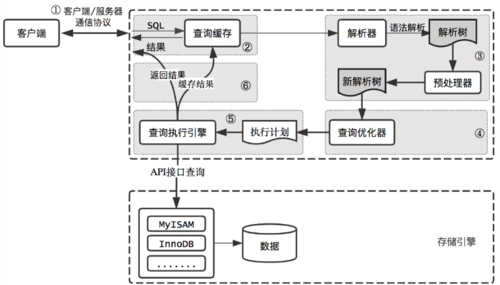

### 分布式消息队列
    消息队列（Message Queue，简称MQ），指保存消息的一个容器，本质是个队列。

    消息（Message）是指在应用之间传送的数据，消息可以非常简单，比如只包含文本字符串，也可以更复杂，可能包含嵌入对象。
    
    下图便是消息队列的基本模型，向消息队列中存放数据的叫做生产者，从消息队列中获取数据的叫做消费者。
1.异步处理
    
    消息队列的主要特点是异步处理，主要目的是减少请求响应时间，实现非核心流程异步化，提高系统响应性能。
    所以异步的典型场景就是将比较耗时而且不需要即时（同步）返回结果的操作，通过消息队列来实现异步化。
    2.应用解耦
    使用了消息队列后，只要保证消息格式不变，消息的发送方和接收方并不需要彼此联系，也不需要受对方的影响，即解耦。
    3.流量削锋
    流量削锋也是消息队列中的常用场景，一般在秒杀或团抢活动中使用广泛。
    这种场景中系统的峰值流量往往集中于一小段时间内，所以为了防止系统在短时间内的峰值流量冲垮，往往采用消息队列来削弱峰值流量，相当于消息队列做了一次缓冲。
    4日志处理
    日志处理是指将消息队列用在日志处理中，比如Kafka的应用，解决大量日志传输的问题。
    上图为整体架构，会涉及三类角色：
    
    1）Producer 消息生产者：负责产生和发送消息到 Broker；
    
    2）Broker 消息处理中心：负责消息存储、确认、重试等，一般其中会包含多个 queue；
    
    3）Consumer 消息消费者：负责从 Broker 中获取消息，并进行相应处理
    
1）RPC 通信
    2）Broker存储
    
    图上第二个步骤，消息到达服务端后需要存储到Broker。
    
    大家关注的流量削峰、最终一致性等需求都是需要Broker先存储下来，然后选择时机投递，这才达到流量削峰、泄洪的目的，所以Broker一个非常重要的功能就是存储。
    
    存储可以做成很多方式，比如存储在内存里，存储在分布式KV里，存储在磁盘里，存储在数据库里等等，存储的选型需要综合考虑性能/高可用和开发维护成本等诸多因素。
    
    目前主流的方案：追加写日志文件（数据部分） + 索引文件的方式，索引设计上可以考虑稠密索引或者稀疏索引，查找消息可以利用跳转表、二份查找等，还可以通过操作系统的页缓存、零拷贝等技术来提升磁盘文件的读写性能。
    
    3）消费模型
    
    图上第三个步骤，消息到达Broker后，最终还是需要Consumer去消费消息，这里就会涉及到到消费模型。
    
    这里的消费模型，目前主要就两种：单播和广播。所谓单播，就是点到点；而广播，是一点对多点。
    
    详细的单播和广播消费模型，下面我会图文详解。
    
    4）高级特性
    
    图上第四个步骤，如果Consumer端把消息消费了，除了需要消息确认，还会涉及到比如：重复消息、顺序消息、消息延迟、事务消息等需要考虑的高级特性。
    
    消息队列MQ模型
    消息队列MQ主要包含两种模型：点对点与发布订阅两种模型。

    发布订阅模型包含三个角色：
    
    主题（Topic）
    
    发布者（Publisher）
    
    订阅者（Subscriber）
    
    多个发布者将消息发送到Topic,系统将这些消息传递给多个订阅者。
    
    特点
    
    每个消息可以有多个消费者：和点对点方式不同，发布消息可以被所有订阅者消费
    
    发布者和订阅者之间有时间上的依赖性。
    
    针对某个主题（Topic）的订阅者，它必须创建一个订阅者之后，才能消费发布者的消息。
    
    为了消费消息，订阅者必须保持运行的状态。

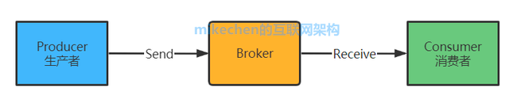

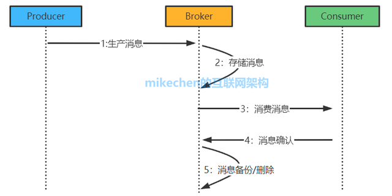

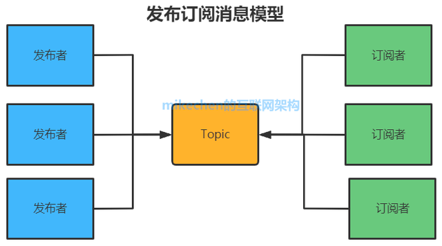
